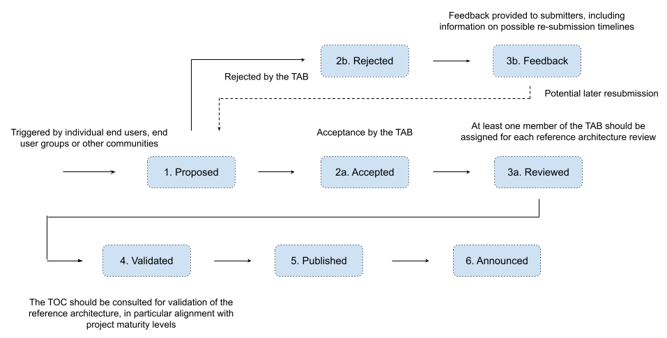

# Reference Architecture Submission Process

This document summarizes the process for the submission, review, and publication of new reference architectures in the CNCF. It describes the expected workflow and the different stakeholders involved in each step.

( <a href="https://docs.google.com/drawings/d/1VkNwpQS_IxZKSl49B-RXzo1Zh2mofQ-MFRyoYhnDkus/edit?usp=sharing">original diagram</a> )

## Workflow Steps

### 1. Proposed

*Who: Individual End Users, Groups of End Users, Community Groups*

New reference architectures should be submitted via [this github template (coming soon)]() by individual end users, groups of end users from a specific domain or end user group, or community groups.

The information to be included in the proposal is in the template, and includes at a minimum:
* The contact for the reference architecture;  
* The end user(s) organization(s) backing the submission and its content;  
* The CNCF projects being used by the stack;
* (optional) The domain or industry of the reference architecture;  

### 2a. Accepted

*Who: Acceptance should be done by the TAB members*

Each submission should be reviewed by the TAB and accepted before the detailed work starts. The purpose of this step is to validate its relevance to the community and clarify any open items, potential overlaps with existing documents, etc.

Once accepted, work should start in expanding the content of the reference architecture.

### 2b. Rejected

*Who: Rejection should be done by the TAB members*

After a review by the assigned TAB member and consultation with the complete TAB a proposal can be rejected.

Rejection can happen due to different reasons, such as a proposal being out of scope for cloud native architectures, excessive reliance on proprietary products, etc.

### 3a. Reviewed

*Who: One or more members of the TAB previously assigned to this reference architecture*

Review of reference architectures is expected to be an iterative process between the submitters and the reviewers assigned by the TAB - usually TAB members. This process aims at keeping the content consistent across different submissions as well as ensuring the key take-aways are properly highlighted.

### 3b. Feedback

*Who: TAB members assigned to this reference architecture*

Feedback should be provided for every reference architecture being rejected (see 2b above). Where appropriate, additional information regarding a potential later resubmission should also be included.

### 4. Validated

*Who: Technical Oversight Committee (TOC)*

Reference architectures often include extensive information regarding the usage of projects in the CNCF, including the end user perspective on the project maturity and production readiness. These might in some cases conflict with the project maturity levels as set by the TOC.

To prevent confusion and conflicting information, the TOC is consulted to validate the reference architecture. The TOC might, if appropriate, request the submitters add additional context information on the usage of a project and explanations on any conflicting views of the project maturity.

### 5. Published

*Who: Reference Architecture submitters, reviewers and CNCF staff*

Once validated the new reference architecture is published under [https://architecture.cncf.io/](https://architecture.cncf.io/). This is done by CNCF staff in coordination with the submitters and the reviewers, collecting additional information relevant for the announcement.

### 6. Announced

*Who: CNCF Staff and TAB*

After publication CNCF staff and TAB take care of the announcement of the new reference architecture via different mechanisms, at least:
* As a news item in the monthly TAB public meeting
* An email circulated to the end user mailing list
* A message in the #enduser and #tab channels in the CNCF slack
