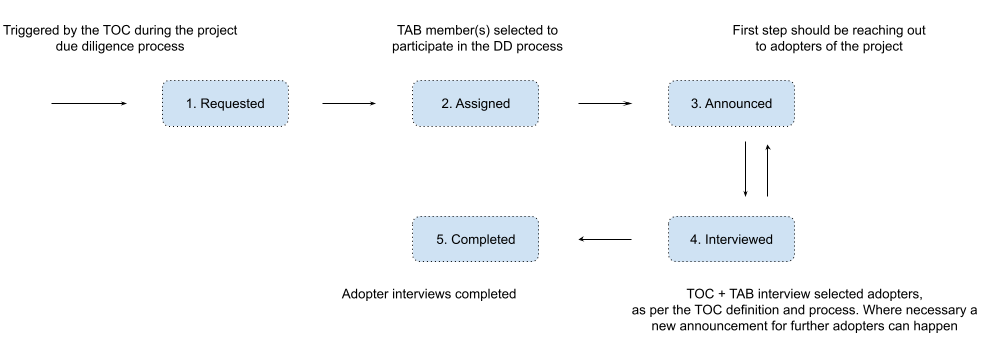

# TOC Adopter Interview Process

This document defines the workflow for the contributions and interactions of the TAB during the project due diligence process (DD) performed by the Technical Oversight Committee (TOC).

( <a href="https://docs.google.com/drawings/d/1J5jJeUduA4cjNX7xqRM2pn0Do-QyDAbsrkZYMsqQR1I/edit?usp=sharing">original diagram</a> )

## Workflow Steps

### 1. Requested

*Who: TOC*

As part of the project due diligence the TOC submits a request to the TAB to participate during adopter interviews. The TOC has information regarding the [definition of an adopter](https://github.com/cncf/toc/blob/main/FAQ.md#what-is-the-definition-of-an-adopter) and the [template for the adopter interviews](https://github.com/cncf/toc/blob/main/operations/toc-templates/template-adopter-questions.md).

The TOC also provides an initial set of adopters to be potentially interviewed, usually provided directly by the project.

### 2. Assigned

*Who: TAB*

The TAB selects one or more members that will drive the adopter interview process and the interactions with the TOC.

### 3. Announced

*Who: Selected TAB member(s)* 

The TAB members assigned to this task reach out to the CNCF end user community to collect a larger set of project adopters that can be interviewed. The goal is to complement the initial adopter list given by the project - to ensure unbiased views as well as cover for provided organizations that do not qualify as adopters or do not show usage at the expected level.

### 4. Interviewed

*Who: Selected TOC \+ TAB members*

The main step in the process, this includes scheduling and performing the interviews with each of the adopters. This is usually done in an informal setting with an online call. A set of suggested questions is documented in [this template](https://github.com/cncf/toc/blob/main/operations/toc-templates/template-adopter-interview-request.md) but those are often extended to explore specific issues or areas of interest being raised or needing clarification.

It is essential to request explicit authorization from the adopter/organization for the publication of the interview content. If this is not possible, the information should be anonymized.

### 5. Completed

*Who: TOC \+ TAB*

The selected TOC and TAB members have completed all interviews, and mark the process complete.
